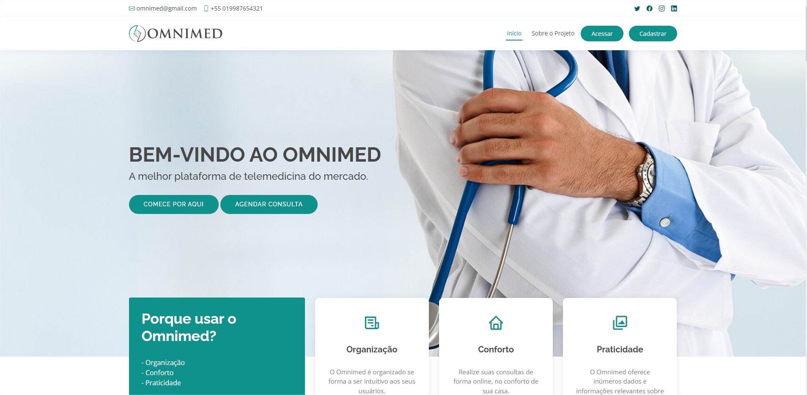

<h1>Plataforma de Telemedicina - Omnimed</h1>

  Um sistema de telemedicina desenvolvido pela minha turma da faculdade de Ciência da Computação (IFSP, campûs de São João da Boa Vista) durante o ano de 2022, este projeto foi trazido pelos professores: Breno Lisi Romano e Everton Rafael da Silva. 
   Atuando como Desenvolvedor, minhas principais tarefas foram relacionadas ao CRUD e gerenciamento de funcionários e dependentes, além de execução de testes e estruturação do projeto. E as principais linguagens utilizadas foram: PHP e JavaScript.

  Confira o link do portal de documentação: https://omnimedportal.esw.dev.br  
  E o link do sistema Omnimed: https://omnimed.esw.dev.br
  
    
  

